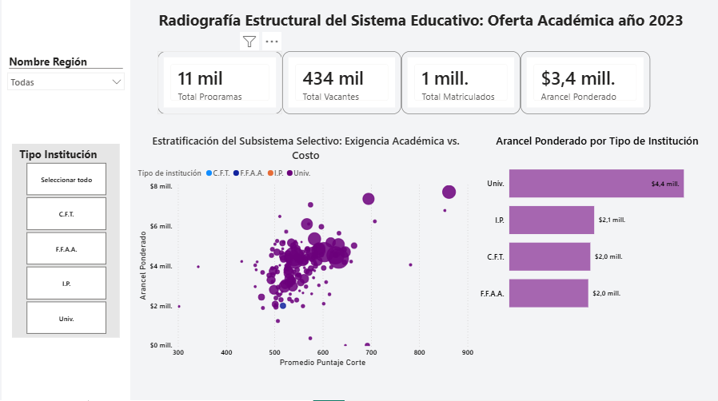
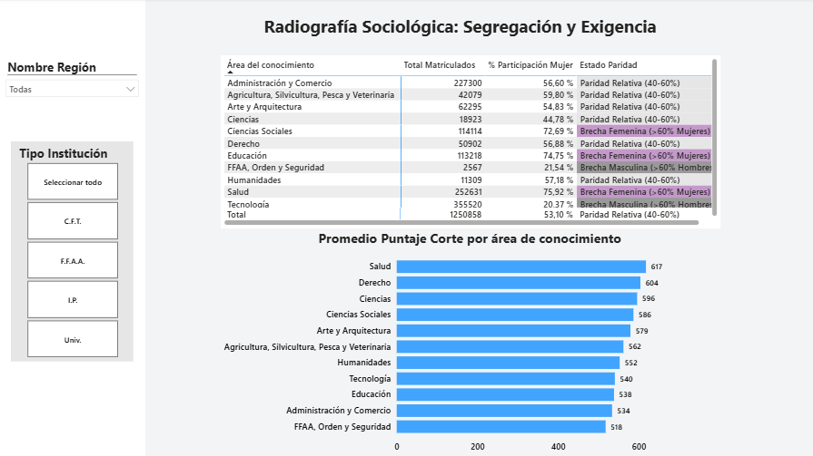
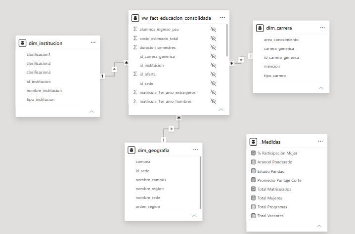

# Análisis BI del Sistema de Educación Superior en Chile

> Proyecto end-to-end de inteligencia de negocios aplicado al acceso, costo y composición sociológica de la oferta académica en Chile.

## Propósito y contexto

El sistema de educación superior chileno es uno de los más segmentados de América Latina. Las decisiones de acceso no obedecen únicamente al mérito académico, sino a una combinación de barreras económicas, exigencia selectiva y patrones estructurales de segregación por género y área del conocimiento.

Este proyecto analiza la **oferta académica del año 2023** — proceso de admisión, aranceles, matrícula y composición de género — y nace de una pregunta concreta: **¿qué revelan los datos administrativos del DEMRE y el CNED cuando se modelan y analizan con rigor técnico?**

La respuesta se construyó como un sistema de inteligencia de negocios completo: desde la ingesta y limpieza de datos hasta un dashboard analítico interactivo de dos páginas, pasando por un modelo relacional en MySQL, vistas semánticas y medidas DAX.

El proyecto está diseñado para responder preguntas de política pública, orientación vocacional y análisis institucional, y es reproducible a partir de fuentes de acceso público.

---

## Dashboard

### Página 1: Radiografía estructural del sistema educativo
Visualiza la distribución de programas, vacantes, matrícula y aranceles según tipo de institución (Universidades, IP, CFT, FF.AA.), con un scatter plot que cruza exigencia académica (puntaje de corte) versus costo (arancel ponderado).



### Página 2: Radiografía sociológica — segregación y exigencia
Analiza la composición de género por área del conocimiento mediante una matriz de clasificación dinámica (brecha femenina, masculina o paridad relativa) y un ranking de exigencia académica promedio por campo disciplinar.



---

## Arquitectura del modelo de datos

Modelo en estrella con una tabla de hechos central y tres dimensiones analíticas.



| Componente | Descripción |
|---|---|
| `vw_fact_educacion_consolidada` | Vista de hechos: matrícula, arancel, puntaje de corte, vacantes |
| `dim_institucion` | Clasificación institucional y tipo |
| `dim_carrera` | Área del conocimiento, carrera genérica y mención |
| `dim_geografia` | Sede, campus, comuna y región |

---

## Stack técnico

| Capa | Herramienta | Uso |
|---|---|---|
| Ingesta y limpieza | Python (pandas) | Normalización, consolidación de fuentes y control de calidad |
| Modelado y backend | MySQL | Esquema estrella, ETL, vistas semánticas, UDFs, procedimientos almacenados, roles de seguridad |
| Semántica analítica | DAX (Power BI) | Medidas dinámicas, promedios ponderados, clasificación de paridad, filtros contextuales |
| Visualización | Power BI Desktop | Modelo semántico, segmentadores, drill-through y experiencia analítica interactiva |

---

## Componentes técnicos destacados

**Backend SQL**
- Esquema en estrella con separación limpia entre hechos y dimensiones
- Vista consolidada `vw_fact_educacion_consolidada` como capa semántica hacia Power BI
- Funciones de ventana para rankings por región e institución
- Stored procedures para carga incremental y control de integridad
- Roles de seguridad con acceso diferenciado por perfil de usuario

**Medidas DAX**
- `Arancel Ponderado`: promedio ponderado por matrícula usando `SUMX` sobre la tabla de hechos
- `Promedio Puntaje Corte`: `CALCULATE` con filtro para excluir registros sin proceso selectivo
- `% Participación Mujer`: ratio dinámico sensible al contexto de filtro activo
- `Estado Paridad`: clasificación con `SWITCH(TRUE())` — brecha femenina, masculina o paridad relativa (40–60%)

---

## Principales hallazgos

- Las universidades concentran las mayores barreras simultáneas: aranceles superiores a $4 millones y puntajes de corte promedio más altos
- Salud y Derecho lideran la exigencia académica con promedios de 617 y 604 puntos respectivamente
- Tecnología e Ingeniería presentan brechas masculinas marcadas (menos del 21% de matrícula femenina)
- Salud y Educación muestran alta feminización relativa, con participación femenina superior al 74%
- FF.AA., Orden y Seguridad concentra la brecha masculina más pronunciada del sistema (21,5% de mujeres)

---

## Estructura del repositorio

```
oferta-academica-bi/
│
├── README.md
│
├── sql/
│   ├── 01_create_schema.sql
│   ├── 02_load_data.sql
│   ├── 03_create_views.sql
│   ├── 04_stored_procedures.sql
│   ├── 05_analytical_queries.sql
│   └── 06_security_roles.sql
│
├── powerbi/
│   └── dashboard_oferta_academica.pbix
│
├── docs/
    ├── arquitectura_modelo.png
    ├── dashboard_pagina_1.png
    └── dashboard_pagina_2.png


```

---

## Fuentes de datos

- **DEMRE** — Proceso de admisión 2023: puntajes de corte y matrícula de primer año
- **CNED** — Oferta académica 2023: aranceles y vacantes por carrera e institución

Datos de acceso público. El repositorio incluye una muestra representativa. La base completa puede reproducirse desde los portales oficiales.

---

## Autor

Sociólogo con especialización en análisis de datos, modelado relacional y visualización analítica aplicada a fenómenos sociales.
